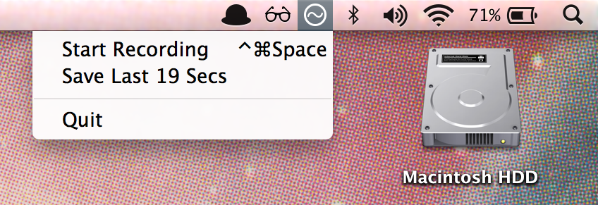

## WavTap

Capture whatever your mac is playing to a .wav file on your Desktop—as simply as a screenshot.



(This is alpha software. It will cause your computer to catch fire. 🔥)

#### Installation

Run the [installer](https://github.com/pje/WavTap/releases/download/0.3.0/WavTap.0.3.0.pkg).

**NB**: As of 10.10, OSX now bans drivers that haven't received explicit approval from Apple. The only workaround I'm aware of is to set a system flag to [globally allow **all** unsigned kernel extensions](http://apple.stackexchange.com/questions/163059/how-can-i-disable-kext-signing-in-mac-os-x-10-10-yosemite). This means WavTap *will not work* unless you've enabled `kext-dev-mode`, using something like this:

```shell
sudo nvram boot-args=kext-dev-mode=1
```

Yes, [this sucks](https://www.gnu.org/philosophy/can-you-trust.html).

#### Uninstallation

`make uninstall` removes everything

##### Nerd Corner

WavTap began as a fork of [Soundflower](https://github.com/Cycling74/Soundflower). thanks to [Cycling '74](http://cycling74.com), [tap](http://github.com/tap), [ma++ ingalls](http://sfsound.org/matt.html), and everyone else who's contributed to it.
